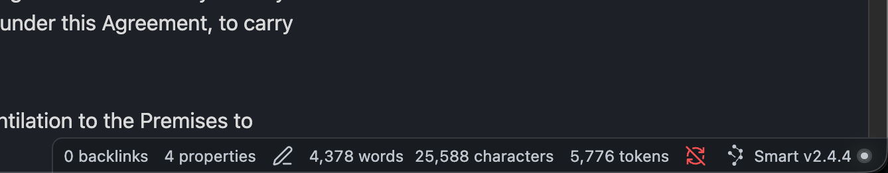

# Token Count

Count tokens for the active note in the status bar, using the same tokenizers as popular LLM APIs (GPT, Claude, and Gemini). **Desktop only.**



## Install

### From Obsidian (recommended)

1. Open **Settings → Community plugins**.
2. Turn on **Community plugins** and **Browse**.
3. Search for **Token Count** and install.
4. Enable the plugin.

### Manual install

1. Download `main.js` and `manifest.json` from the [latest GitHub release](https://github.com/lemondepat/token-count/releases/latest).
2. Create a folder in your vault: `.obsidian/plugins/token-count/`
3. Copy both files into that folder.
4. Enable **Token Count** under **Settings → Community plugins**.

## Usage

Open any Markdown note. The status bar shows the token count for the full note, for example:

```text
1,234 tokens · gpt-5
```

The count updates as you edit. It appears after Obsidian’s built-in word and character count when the core **Word count** plugin is enabled.

## Settings

**Settings → Token Count**

| Option | Description |
|--------|-------------|
| Model | `gpt-5`, `gpt-4o`, `gpt-4`, `claude`, or `gemini` |
| Show model in status bar | Show the model name after the count (e.g. `· gpt-5`) |

## Notes

- Counts the **entire editor content**, including YAML frontmatter.
- Useful for estimating how much of a note fits in an LLM context window; system prompts or chat wrappers are not included.
- **Gemini**: the first count may download a vocabulary file once (requires network).
- Empty when no Markdown editor is active.

## Development

Requires Node.js 18+.

```bash
npm install
npm run build
```

Symlink or copy this repo into `<Vault>/.obsidian/plugins/token-count/` for local testing. Use `npm run dev` to rebuild on save.

See [RELEASING.md](RELEASING.md) for publishing a new version.

## License

MIT — see [LICENSE](LICENSE).
